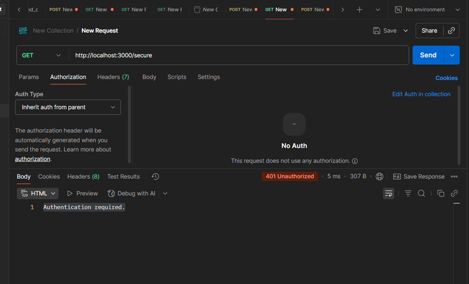
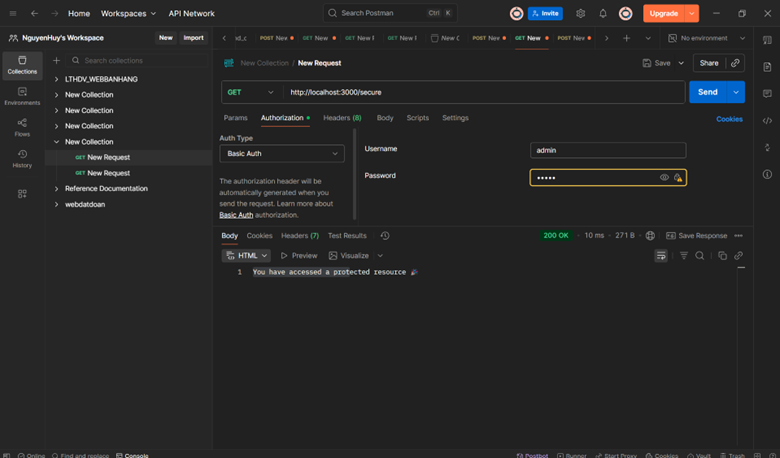
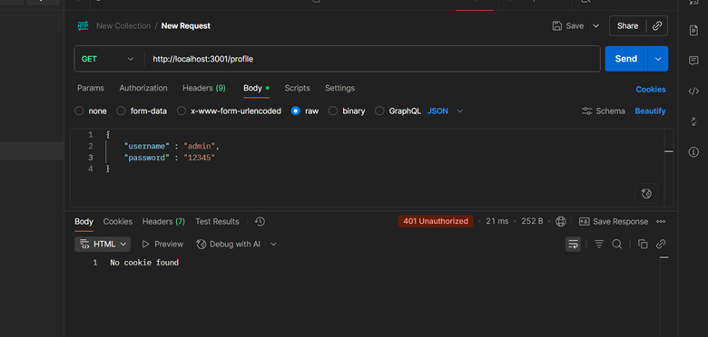
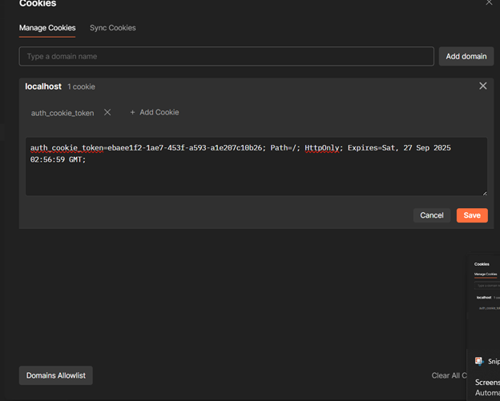
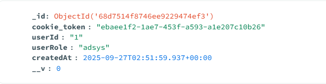

# Lap6 Simple Auth Demo

## CÂU A

Truy cập vào URI `/secure` khi chưa đăng nhập, kết quả trả về:  
**Authentication required**.

---

### Các bước đăng nhập

Vào mục **Authorization**, chọn kiểu Auth type là **Basic Auth**, sau đó ấn **Send**.  
Kết quả trả về từ URI `http://localhost:3000/secure`:  
**"You have accessed a protected resource" 🎉**

---

## CÂU B

Truy cập vào URI `/profile` trước khi đăng nhập bằng POSTMAN, kết quả trả về:  
**No cookie found**.

*Lưu ý: Vì chưa đăng nhập nên không truy cập được (chưa có cookie gửi về server).*

---

### Đăng nhập với POST `/login`

Truy cập vào URI `/login` với phương thức **POST**, truyền thông tin đăng nhập dạng **JSON** trong body.  
Kết quả trả về:

- Trả về **cookie**  
- Trả về thông báo: **"Logged in !!!"**

---

### Session lưu trong MongoDB

Thông tin đăng nhập session được lưu trong MongoDB:

